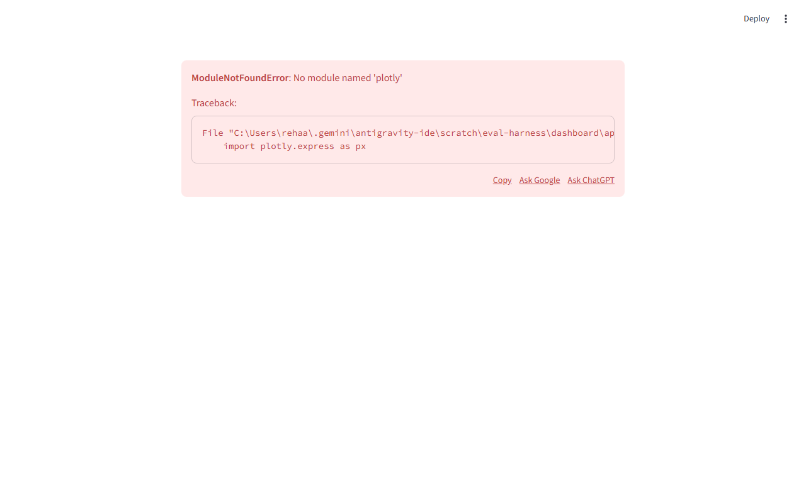

# LLM Evaluation & Regression Testing Platform

A production-style eval harness that catches regressions in LLM agents by running a golden test suite against them, scoring outputs with deterministic checks and LLM-as-judge, and diffing runs across code versions.

## Why this exists
LLM agents silently break when you change prompts, models, or underlying code. A change intended to fix a bug in tool routing might subtly destroy semantic memory capabilities. This harness solves this by treating agent evaluation as a CI/CD engineering problem. It provides a reliable, repeatable, and automated way to catch regressions before they hit production by running a deterministic evaluation pipeline across various code versions.

## Demo

*The regression viewer catching 9 real regressions when tools were disabled in a test run.*

## What it does
- Runs a suite of 20 test cases against an LLM agent over HTTP.
- Scores each output with two independent layers: deterministic structural checks (fast, free) and an LLM-as-judge (Claude Haiku, cross-vendor to avoid self-preference bias).
- Persists every run to SQLite — full audit trail, no run is ever overwritten.
- Diffs any two runs to surface regressions, improvements, and score drops with a CI-friendly exit code.

## Architecture
```text
  Test Cases 
      │
      ▼
   Runner ──► Adapter ──► Agent (HTTP)
      │                       │
      │                       ▼
      └──────────────────►   SQL
                              │
                              ▼
                           Scorers (Deterministic + LLM Judge)
                              │
                              ▼
                            Differ
                              │
                              ▼
                          Dashboard
```

## Quick start
```bash
# 1. Clone the repository
git clone https://github.com/example/eval-harness.git
cd eval-harness

# 2. Create and activate a virtual environment
python -m venv venv
.\venv\Scripts\activate

# 3. Install requirements
pip install -r requirements.txt

# 4. Set required environment variables
# Requires OPENROUTER_API_KEY for the LLM Judge
echo "OPENROUTER_API_KEY=your_key_here" > .env

# 5. Start the research agent shim (in another terminal or background)
cd ../research_agent
python server.py
cd ../eval-harness

# 6. Run the test suite against the agent and automatically score it
python main.py --agent research_agent --auto-score

# 7. View the dashboard
streamlit run dashboard/app.py
```

## A real regression it caught
During Phase 3 development, I deliberately commented out the tool schemas in the research agent's `runner.py` to simulate a regression. The harness detected 9 failing test cases across three categories (tool_routing, semantic_memory, guardrail) in a single diff run, with a machine-parseable exit code of 1. See the sample regression report in `docs/sample_regression_report.txt`.

## Design decisions worth mentioning
- HTTP boundary (not direct import) exercises the same serialization path production would.
- Cross-vendor judge (Claude Haiku scoring OpenAI-generated agent output) removes self-preference bias.
- Deterministic layer runs first because it's free — LLM judge only spends tokens on cases where structure is right.
- Scoring is decoupled from execution — you can rescore an old run with a new rubric without re-hitting the agent.

## What's next
- **More test cases:** Expanding the dataset to include broader tool combinations.
- **Other agents:** Adapting the shim to target different agent architectures.
- **GitHub Actions integration:** Hooking the differ up to PR comments for automated CI feedback.
- **Richer visualizations:** Adding token usage and cost trend charts over time.

## Repo structure
```text
eval-harness/
├── config/
├── dashboard/
├── docs/
├── golden_dataset/
├── harness/
├── .env
├── .gitignore
├── eval_harness.db
├── main.py
└── requirements.txt
```
